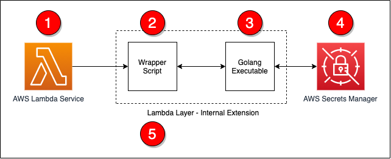

# Creating AWS Lambda environment variable from AWS Secrets Manager

[AWS Lambda](https://aws.amazon.com/lambda/) layers and extensions are used by third-party software providers for monitoring Lambda functions. A monitoring solution needs environmental variables to provide configuration information to send metric information to an endpoint.

Managing this information as environmental variables across thousands of Lambda functions creates operational overhead. Instead, you can use the approach in this blog post to create environmental variables dynamically from information hosted in [AWS Secrets Manager](https://aws.amazon.com/secrets-manager/).

This can help avoid managing secret rotation for individual functions. It ensures that values stay encrypted until runtime, and abstracts away the management of the environmental variables.

## Overview

This post shows how to create a Lambda layer for Node.js, Python, Ruby, Java, and .NET Core runtimes. It retrieves values from Secrets Manager and converts the secret into an environmental variable that can be used by other layers and functions. The Lambda layer uses a [wrapper script](https://docs.aws.amazon.com/lambda/latest/dg/runtimes-modify.html#runtime-wrapper) to fetch information from Secrets Manager and create environmental variables.



The steps in the process are as follows:

1. The Lambda service responds to an event and initializes the Lambda context.
1. The wrapper script is called as part of the Lambda init phase.
1. The wrapper script calls a Golang executable passing in the ARN for the secret to retrieve.
1. The Golang executable uses the Secrets Manager API to retrieve the decrypted secret.
1. The wrapper script converts the information into environmental variables and calls the next step in processing.

## The wrapper script

The wrapper script is the main entry-point for the extension and is called by the Lambda service as part of the init phase. During this phase, the wrapper script will read in basic information from the environment and call the Golang executable. If there was an issue with the Golang executable, the wrapper script will log a statement and exit with an error.

```bash
# Get the secret value by calling the Go executable
values=$(${fullPath}/go-retrieve-secret -r "${region}" -s "${secretArn}" -a "${roleName}" -t ${timeout})
last_cmd=$?

# Verify that the last command was successful
if [[ ${last_cmd} -ne 0 ]]; then
    echo "Failed to setup environment for Secret ${secretArn}"
    exit 1
fi
```
## Golang executable

This uses Golang to invoke the AWS APIs since the Lambda execution environment does natively provide the AWS Command Line Interface. The Golang executable can be included in a layer so that the layer works with a number of Lambda runtimes.

The Golang executable captures and validates the command line arguments to ensure that required parameters are supplied. If Lambda does not have permissions to read and decrypt the secret, you can supply an ARN for a role to assume.

The following code example shows how the Golang executable retrieves the necessary information to assume a role using the AWS Security Token Service:

```go
client := sts.NewFromConfig(cfg)

return client.AssumeRole(ctx,
    &sts.AssumeRoleInput{
        RoleArn: &roleArn,
        RoleSessionName: &sessionName,
    },
)
```

After obtaining the necessary permissions, the secret can be retrieved using the Secrets Manager API. The following code example uses the new credentials to create a client connection to Secrets Manager and the secret:

```go
client := secretsmanager.NewFromConfig(cfg, func(o *secretsmanager.Options) {
    o.Credentials = aws.NewCredentialsCache(credentials.NewStaticCredentialsProvider(*assumedRole.Credentials.AccessKeyId, *assumedRole.Credentials.SecretAccessKey, *assumedRole.Credentials.SessionToken))
})
return client.GetSecretValue(ctx, &secretsmanager.GetSecretValueInput{
    SecretId: aws.String(secretArn),
})
```

After retrieving the secret, the contents must be converted into a format that the wrapper script can use. The following sample code covers the conversion from a secret string to JSON by storing the data in a map. Once the data is in a map, a loop is used to output the information as key-value pairs.

```go
// Convert the secret into JSON
var dat map[string]interface{}

// Convert the secret to JSON
if err := json.Unmarshal([]byte(*result.SecretString), &dat); err != nil {
    fmt.Println("Failed to convert Secret to JSON")
    fmt.Println(err)
    panic(err)
}

// Get the secret value and dump the output in a manner that a shell script can read the
// data from the output
for key, value := range dat {
    fmt.Printf("%s|%s\n", key, value)
}
```

## Conversion to environmental variables

After the secret information is retrieved by using Golang, the wrapper script can now loop over the output, populate a temporary file with export statements, and execute the temporary file. The following code covers these steps:

```bash
# Read the data line by line and export the data as key value pairs 
# and environmental variables
echo "${values}" | while read -r line; do 
    
    # Split the line into a key and value
    ARRY=(${line//|/ })

    # Capture the kay value
    key="${ARRY[0]}"

    # Since the key had been captured, no need to keep it in the array
    unset ARRY[0]

    # Join the other parts of the array into a single value.  There is a chance that
    # The split man have broken the data into multiple values.  This will force the
    # data to be rejoined.
    value="${ARRY[@]}"
    
    # Save as an env var to the temp file for later processing
    echo "export ${key}=\"${value}\"" >> ${tempFile}
done

# Source the temp file to read in the env vars
. ${tempFile}
```

At this point, the information stored in the secret is now available as environmental variables to layers and the Lambda function.

## Deployment

To deploy this solution, you must build on an instance that is running an [Amazon Linux 2 AMI](https://aws.amazon.com/amazon-linux-2/). This ensures that the compiled Golang executable is compatible with the Lambda execution environment.

The easiest way to deploy this solution is from an [AWS Cloud9](https://aws.amazon.com/cloud9/) environment but you can also use an [Amazon EC2](https://aws.amazon.com/ec2/) instance. To build and deploy the solution into your environment, you need the ARN of the secret that you want to use. A build script is provided to ease deployment and perform compilation, archival, and [AWS CDK](https://aws.amazon.com/cdk/) execution.

To deploy, run:

```sh
./build.sh <ARN of the secret to use>
```

Once the build is complete, the following resources are deployed into your AWS account:

1. A Lambda layer (called get-secrets-layer)
1. A second Lambda layer for testing (called second-example-layer)
1. A Lambda function (called example-get-secrets-lambda)

## Testing

To test the deployment, create a test event to send to the new **example-get-secrets-lambda** Lambda function using the AWS Management Console. The test Lambda function uses both the **get-secrets-layer** and **second-example-layer** Lambda layers, and the secret specified from the build. This function logs the values of environmental variables that were created by the get-secrets-layer and second-example-layer layers:

The secret contains the following information:

```json
{
    "EXAMPLE_CONNECTION_TOKEN": "EXAMPLE AUTH TOKEN",
    "EXAMPLE_CLUSTER_ID": "EXAMPLE CLUSTER ID",
    "EXAMPLE_CONNECTION_URL": "EXAMPLE CONNECTION URL",
    "EXAMPLE_TENANT": "EXAMPLE TENANT",
    "AWS_LAMBDA_EXEC_WRAPPER": "/opt/second-example-layer"
}
```

This is the Python code for the example-get-secrets-lambda function:

```python
import os
import json
import sys

def lambda_handler(event, context):
    print(f"Got event in main lambda [{event}]",flush=True)
    
    # Return all of the data
    return {
        'statusCode': 200,
        'layer': {
            'EXAMPLE_AUTH_TOKEN': os.environ.get('EXAMPLE_AUTH_TOKEN', 'Not Set'),
            'EXAMPLE_CLUSTER_ID': os.environ.get('EXAMPLE_CLUSTER_ID', 'Not Set'),
            'EXAMPLE_CONNECTION_URL': os.environ.get('EXAMPLE_CONNECTION_URL', 'Not Set'),
            'EXAMPLE_TENANT': os.environ.get('EXAMPLE_TENANT', 'Not Set'),
            'AWS_LAMBDA_EXEC_WRAPPER': os.environ.get('AWS_LAMBDA_EXEC_WRAPPER', 'Not Set')
        },
        'secondLayer': {
            'SECOND_LAYER_EXECUTE': os.environ.get('SECOND_LAYER_EXECUTE', 'Not Set')
        }
    }
```

When running a test using the AWS Management Console, you see the following response returned from the Lambda in the AWS Management Console:

```json
{
    "statusCode": 200,
    "layer": {
        "EXAMPLE_AUTH_TOKEN": "EXAMPLE AUTH TOKEN",
        "EXAMPLE_CLUSTER_ID": "EXAMPLE CLUSTER ID",
        "EXAMPLE_CONNECTION_URL": "EXAMPLE CONNECTION URL",
        "EXAMPLE_TENANT": "EXAMPLE TENANT",
        "AWS_LAMBDA_EXEC_WRAPPER": "/opt/second-example-layer"
    },
    "secondLayer": {
        "SECOND_LAYER_EXECUTE": "true"
    }
}
```

> When the secret changes, there is a delay before those changes are available to the Lambda layers and function. This is because the layer only executes in the init phase of the Lambda lifecycle. After the Lambda execution environment is recreated and initialized, the layer executes and creates environmental variables with the new secret information.

## Conclusion

This solution provides a way to convert information from Secrets Manager into Lambda environment variables. By following this approach, you can centralize the management of information through Secrets Manager, instead of at the function level.

For more information about the Lambda lifecycle, see the [Lambda execution environment lifecycle](https://docs.aws.amazon.com/lambda/latest/dg/runtimes-context.html#runtimes-lifecycle) documentation.

## Security

See [CONTRIBUTING](CONTRIBUTING.md#security-issue-notifications) for more information.

## License

This library is licensed under the MIT-0 License. See the [LICENSE](LICENSE) file.